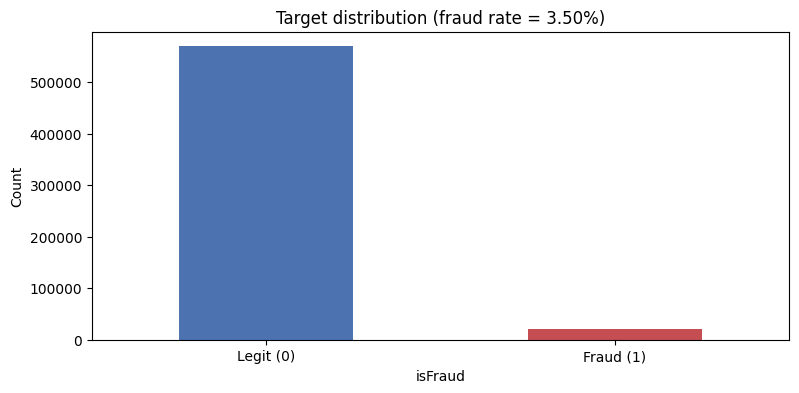
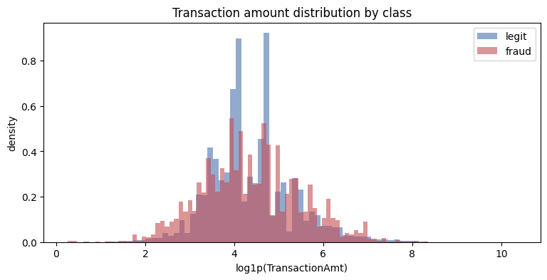
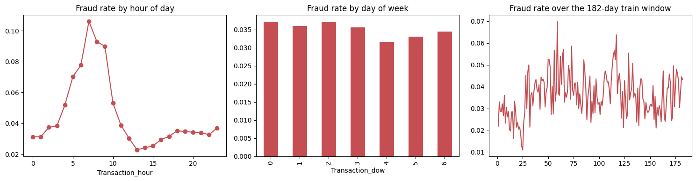
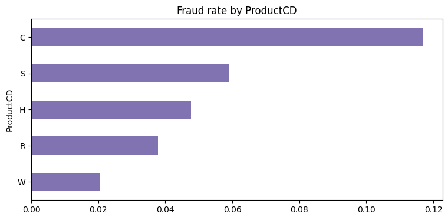
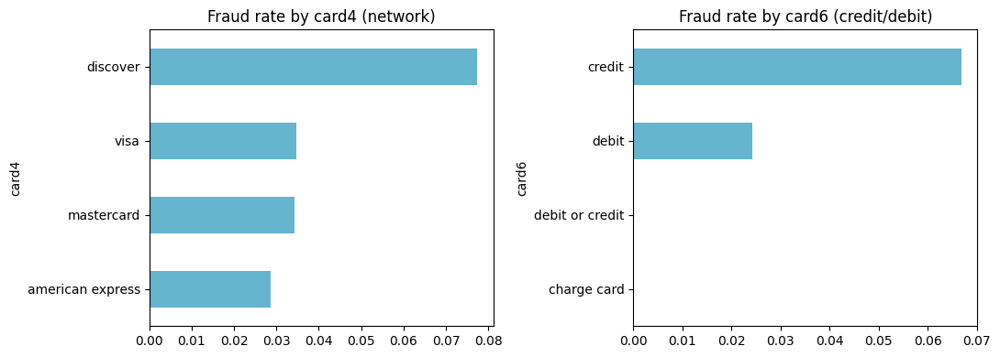
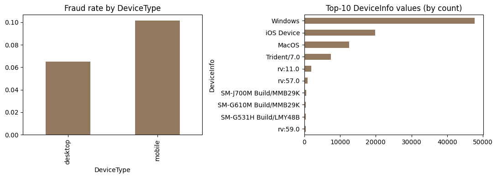
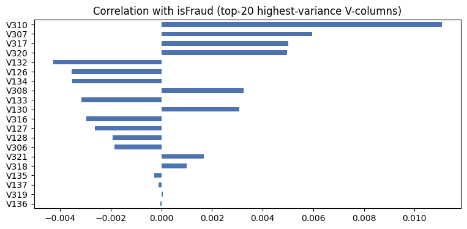
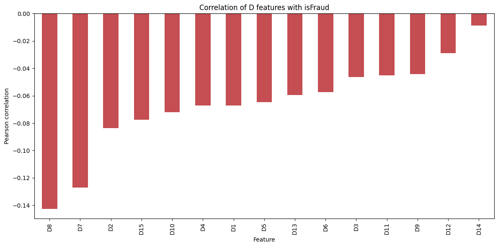
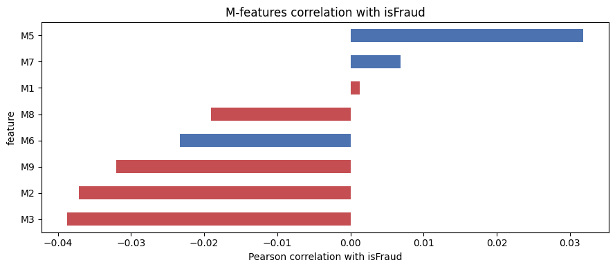

# EDA on Dataset — IEEE-CIS Fraud Detection

## The dataset

The dataset comes from a Kaggle research competition organized by the IEEE Computational Intelligence Society (IEEE-CIS), with the actual data provided by Vesta Corporation
Vesta is a , a payment-guarantee company for e-commerce.
Dataset contains real-world e-commerce transactions.
The link to download the dataset is below
- **Link**: https://www.kaggle.com/competitions/ieee-fraud-detection/data

The dataset consist of real anonymised e-commerce transactions.

**The problem:** Identify fraudulent transaction.

## Dataset details
The dataset consists of 4 csv files
1. train_transaction.csv ((590,540 rows),~394 columns )
2. train_identity.csv (144,233 rows, ~41 columns)
3. test_transaction.csv (506,691 rows)
4. test_identity.csv  (141,907 rows)

We can merge the train_transaction csv with train_identity by using the `TransactionID` column. 
The field `isFraud` is the target label which is found onky  in training dataset 

## Columns and Descriptions

### `train_transaction.csv` — 394 columns

| Group | Columns | Count | Description |
|---|---|---|---|
| ID / target | `TransactionID`, `isFraud` | 2 | Unique row identifier and the binary fraud label (target) |
| Core | `TransactionDT`, `TransactionAmt`, `ProductCD` | 3 | `TransactionDT` is a time delta (seconds) from a reference datetime, not an absolute timestamp; `TransactionAmt` is the transaction amount; `ProductCD` is the product code for the transaction |
| Card | `card1`–`card6` | 6 | Payment card information — card type, category, issuing bank, country, etc. (anonymized) |
| Address | `addr1`, `addr2` | 2 | Purchaser address region fields |
| Distance | `dist1`, `dist2` | 2 | Distance fields (e.g., between billing address, shipping address, IP, etc.) |
| Email | `P_emaildomain`, `R_emaildomain` | 2 | Purchaser and recipient email domains |
| Counting features | `C1`–`C14` | 14 | Counts of things — e.g., how many addresses are associated with a card, etc. (actual meaning masked) |
| Time-delta features | `D1`–`D15` | 15 | Time deltas — e.g., days since a previous transaction on the same card/entity |
| Match flags | `M1`–`M9` | 9 | Match indicators — e.g., whether the name on the card matches the address, etc. |
| Anonymized (Vesta) features | `V1`–`V339` | 339 | Vesta-engineered, anonymized features (ranking, counting, other entity relations) — the bulk of the column count; largely opaque/undocumented |

### `train_identity.csv` — 41 columns

| Group | Columns | Count | Description |
|---|---|---|---|
| Join key | `TransactionID` | 1 | Foreign key used to merge with `train_transaction.csv` |
| Identity features | `id_01`–`id_38` | 38 | Network and digital signature signals (IP, ISP, proxy, browser fingerprint) and behavioral fingerprints — mostly anonymized/numeric, sparsely populated |
| Device | `DeviceType`, `DeviceInfo` | 2 | Device category (mobile/desktop) and device/browser info string |

## Column Semantics

Most columns are anonymized or opaque — in particular the `V`-columns and `id_`-columns carry no documented business meaning, only statistical/behavioral signal inferred from naming conventions and EDA (distributions, correlation with `isFraud`, missingness patterns).

# Exploratory data analysis

Below is an exploratory data analysis of the dataset to understand its structure, characteristics, and patterns. 

## Missing value analysis

| Column / Column Group | Missing Percent |
| --- | --- |
| TransactionID | 0% |
| isFraud | 0% |
| TransactionDT | 0% |
| TransactionAmt | 0% |
| ProductCD | 0% |
| dist2 | 93.62% |
| dist1 | 59.65% |
| R_emaildomain | 76.75% |
| P_emaildomain | 15.99% |
| addr1 | 11.12% |
| addr2 | 11.12% |
| D1-D15 | 58.15% |
| M1-M9 | 49.92% |
| V1-V339 | 43.04% |
| card1-card6 | 0.51% |
| C1-C14 | 0% |

The dataset shows other than coe columns like TransactionDT, TransactionAmt there is significant sparsity in other columns

| Column / Column Group | Missing Percent |
| --- | --- |
| id_24 | 96.71% |
| id_25 | 96.44% |
| id_07 | 96.43% |
| id_08 | 96.43% |
| id_21 | 96.42% |
| id_26 | 96.42% |
| id_22 | 96.42% |
| id_23 | 96.42% |
| id_27 | 96.42% |
| id_18 | 68.72% |
| id_03 | 54.02% |
| id_04 | 54.02% |
| id_33 | 49.19% |
| id_09 | 48.05% |
| id_10 | 48.05% |
| DeviceInfo | 17.73% |
| DeviceType | 2.37% |

We see significant sparsity of data in train_identity.csv as well

## Fraud rate
We see the target distribution and see around 3.5% are fraud

## Transaction amount and impact on fraud

Both legitimate and fraudulent transactions have their primary mass centered between 3.0 and  6.0 . Because the distributions broadly align, transaction amount alone is insufficient as a standalone fraud predictor.
TransactionAmt (even log-transformed) is likely a weak standalone feature but binning can help

## Time of transaction
Day-of-week is a weak signal. Hour-of-day is the standout feature
Fraud rate swings from ~0.023 (trough, hour 13) to ~0.106 (peak, hour 7) — a 4-5x relative difference. That's a genuinely useful signal. Cyclical encoding this feature (sin/cos of hour) rather than treating it as linear/categorical will help a model use it properly

Fraud rate over the 182-day window is noisy but non-stationary

## Product code

product code is a strong categorical signal, product code C stands well apart from the rest; S, H, R form a middle cluster; W is the clear low-risk category

## Card type

card6 (credit/debit) looks like a genuinely useful, low-noise binary-ish signal.
card4 (network) has an interesting pattern but needs a volume sanity-check before you trust the Discover spike — pair this chart with a transaction-count bar chart per category, same recommendation as for ProductCD.
Both are good candidates for target encoding given low cardinality, but I'd suppress/smooth categories with very low counts (like "charge card") using something like Bayesian smoothing toward the global mean, rather than letting a 0-transaction category produce a misleading 0.0 rate.

## Device type and Device info

Mobile shows a meaningfully higher fraud rate than desktop. Mobile-originated fraud being higher is a fairly common pattern in the literature — easier to spoof device fingerprints, higher rates of account-takeover via mobile, less mature fraud tooling on some mobile flows historically. Windows (~47k) dwarfs everything else — roughly 2.4x iOS Device (~20k) and 4x MacOS (~12k).

## Counting features C1-C8
`C1`-`C14`: counting features (e.g. # cards/addresses associated with this transaction) — mostly dense
The following table shows the correlation between counting features and isFraud

| feature | pearson_correlation | abs_correlation |
|---|---|---|
| C2 | 0.04 | 0.04 |
| C8 | 0.03 | 0.03 |
| C12 | 0.03 | 0.03 |
| C9 | -0.03 | 0.03 |
| C5 | -0.03 | 0.03 |
| C1 | 0.03 | 0.03 |
| C4 | 0.03 | 0.03 |
| C10 | 0.03 | 0.03 |
| C7 | 0.03 | 0.03 |
| C11 | 0.03 | 0.03 |
| C6 | 0.02 | 0.02 |
| C13 | -0.01 | 0.01 |
| C14 | 0.01 | 0.01 |
| C3 | -0.01 | 0.01 |

There is weak linear correlation between the counting features and isFraud

##  features V1-V339
These are Vesta-engineered, anonymized features (ranking, counting, other entity relations) — the bulk of the column count; largely opaque/undocumented. Like counting features , Vesta features do not exhibit any linear correllation with fraud label.

After applying PCA to the V-column features (92 components, 95% variance retained), we evaluated their predictive power using a logistic regression probe, which achieved a validation AUC of 0.82. Signal was concentrated in a few components — PC2, PC4, and PC3 showed the strongest correlation with isFraud — indicating PCA successfully consolidated fraud-relevant variance that was diffuse and individually weak across the raw V-columns.

## feature D1-D15
In IEEE-CIS-style data, D-columns are typically time-delta features — days since a previous transaction, days since account/card was first seen, days since address was registered, etc. A consistent negative correlation makes strong intuitive sense

D-features looks best raw (non-PCA) feature family , and the direction of the relationship has a clean, plausible causal story behind it 

## features id1-id38

this looks like your strongest feature family on raw correlation alone. id_17 at 0.150 is actually the single strongest raw correlation
| feature | pearson_correlation | abs_correlation |
|---|---|---|
| id_17 | 0.150100 | 0.150100 |
| id_01 | -0.120099 | 0.120099 |
| id_22 | 0.118409 | 0.118409 |
| id_26 | 0.099587 | 0.099587 |
| id_07 | -0.084768 | 0.084768 |
| id_32 | 0.069702 | 0.069702 |
| id_21 | 0.063544 | 0.063544 |
| id_20 | 0.061597 | 0.061597 |
| id_04 | -0.059701 | 0.059701 |
| id_08 | -0.057489 | 0.057489 |
| id_14 | 0.057324 | 0.057324 |
| id_18 | 0.050004 | 0.050004 |
| id_02 | 0.049398 | 0.049398 |
| id_19 | -0.041721 | 0.041721 |
| id_03 | 0.041457 | 0.041457 |
| id_25 | 0.034045 | 0.034045 |
| id_09 | 0.029431 | 0.029431 |
| id_06 | -0.027139 | 0.027139 |
| id_13 | -0.019538 | 0.019538 |
| id_10 | 0.011043 | 0.011043 |
| id_05 | -0.007978 | 0.007978 |
| id_11 | 0.007914 | 0.007914 |
| id_24 | -0.001905 | 0.001905 |

## features m1-m9
Correllation Magnitudes are modest  between M-features and fraud label — closer to the C-feature tier

## Summary Notes 

- Identity data is sparse: only ~24% of transactions in `train_transaction.csv` have a matching row in `train_identity.csv`.
- Because of the large number of anonymized `V`, `C`, `D`, and `id_` columns, the EDA notebook and downstream pipeline typically rely on missingness analysis, variance-based feature selection (e.g., top-50 `V`-columns by variance), and aggregation rather than semantic interpretation of individual columns.
- Fields like `card1`–`card6`, `addr1`–`addr2`, `P_emaildomain`/`R_emaildomain`, and `DeviceType`/`DeviceInfo` are the key shared identifiers used later to construct the transaction graph for the GNN model (see [README.md](../README.md)).

## Overall Summary and Feature Engineering Implications

The EDA points to a dataset that is highly imbalanced (~3.5% fraud), heavily anonymized (`V`, `C`, `D`, `id_` columns), and inconsistently sparse across feature families. Below is a consolidated view of what each analysis implies for feature engineering / transformation, feature-family by feature-family.

| EDA Finding | Feature Engineering / Transformation Implication |
|---|---|
| Fraud rate ≈ 3.5% (class imbalance) | Use class-weighted loss, resampling (SMOTE/undersampling), or threshold tuning rather than accuracy-based evaluation; use AUC/PR-AUC as the metric. |
| `TransactionAmt` distributions overlap for fraud/legit | Log-transform `TransactionAmt` and bin it into ranges rather than relying on it as a raw linear feature. |
| Hour-of-day fraud rate swings ~0.023 → ~0.106 (strong signal) | Extract hour-of-day from `TransactionDT` and apply **cyclical encoding** (sin/cos) instead of treating it as linear or one-hot categorical. |
| Day-of-week is a weak signal | Low priority for engineering; can be dropped or kept as a minor categorical feature. |
| Fraud rate is non-stationary over the 182-day window | Use **time-based (not random) train/validation splits** to avoid leakage and to reflect real deployment drift. |
| `ProductCD` is a strong categorical signal (C stands apart; S/H/R form a middle cluster; W is low-risk) | Keep as a categorical feature (one-hot or target-encoded); consider collapsing S/H/R into a grouped "middle-risk" category. |
| `card6`/`card4` show useful, low-cardinality patterns | Target-encode `card4`/`card6`, but apply **smoothing (e.g., Bayesian smoothing toward the global mean)** for low-count categories (e.g., "charge card") to avoid misleading 0%/100% rates; validate `card4` spikes against transaction-count volume first. |
| Mobile devices show higher fraud rate; Windows dominates device volume | Engineer `DeviceType` as a binary/categorical feature; parse `DeviceInfo` strings into coarser OS/device-family buckets rather than using the raw high-cardinality string. |
| `C1`–`C14` are dense but only weakly correlated (∣r∣ ≤ ~0.04) with `isFraud` | Keep as raw numeric features (low missingness makes them cheap to include), but treat as low-priority/supporting signal rather than primary drivers. |
| `V1`–`V339` are opaque, individually weak, but PCA (92 components, 95% variance) + logistic regression reaches 0.82 AUC | **Dimensionality-reduce the V-block via PCA** (or similar, e.g. autoencoder) rather than feeding all 339 raw columns; the strongest components (PC2–PC4) are worth inspecting/prioritizing further. |
| `D1`–`D15` (time deltas) show a clean, consistently-signed correlation with `isFraud` | Best used **raw** (non-PCA) — impute missing values (58% missing) with a sentinel/indicator rather than transforming, since the raw relationship is already interpretable and predictive. |
| `id_01`–`id_38` contain the single strongest raw correlations (`id_17` at 0.150, `id_01`, `id_22`, `id_26`, `id_07`, …) | Prioritize these as top raw features; still add missingness indicators given many `id_` columns are >90% sparse. |
| `M1`–`M9` show modest correlation, similar tier to `C`-features | Keep as low-priority raw/binary features; consider aggregating into a "match-flag count" summary feature. |
| Severe, uneven missingness across `dist1/dist2`, `R_emaildomain`, `D`, `M`, `V`, and most `id_` columns | Add **missing-value indicator flags** per feature/group and choose an imputation strategy (e.g., sentinel value, median) rather than dropping sparse columns outright, since missingness itself may be informative. |
| Only ~24% of transactions have a matching `train_identity.csv` row | Add a `has_identity` binary flag as its own feature, and treat identity-derived features as conditional/secondary signals. |
| Shared identifiers (`card1`–`card6`, `addr1`–`addr2`, email domains, `DeviceType`/`DeviceInfo`) recur across transactions | These are the primary keys for **building graph edges** (shared card/address/device/email) for the downstream GNN model, in addition to any use as tabular features. |

**Net takeaway:** the EDA motivates (1) imbalance-aware modeling, (2) targeted transforms — log/bin for `TransactionAmt`, cyclical encoding for hour-of-day, smoothed target encoding for low-cardinality categoricals, PCA for the opaque `V`-block — (3) missingness-aware handling (indicator flags + imputation) across the sparse `D`/`M`/`V`/`id_` families, (4) a time-based validation split given the non-stationary fraud rate, and (5) preserving the shared identifier columns (card/address/email/device) largely untransformed, since they double as the relational keys for constructing the transaction graph used by the GNN model.
